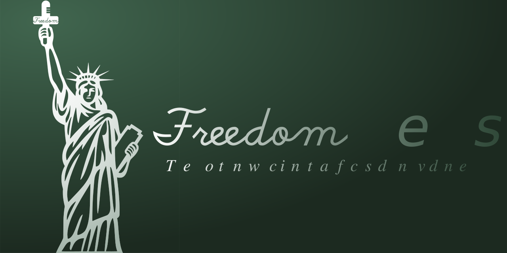

# Freedom News - The Nostr news client that focused on evidence

> We hold this truth to be self-evident, that knowing the truth is one of the inherent and unalienable rights of the people. ... the truth will eventually dispel the lies, ... it is our right, it is our duty to reveal the truth and to restore freedom of speech. ... (*[Declaration of the Truth](https://github.com/Ialitheia-Program/Declaration-of-the-Truth)*)

Thanks to the Nostr protocol, its creators, the relays and their maintainers, we can now give everyone in the world who has access to the Internet the equal right to know to the truth or describe it. We didn't see a dedicated news client focused on this at the moment, so let's do it.

## Our duty

### For the brave journalist

We provide an anonymous, tamper-proof, censorship-free, publishing platform with a near-perpetual storage system for related information. We also socially reward high quality content based on traffic profit.

### For the truth-seeking readers

A decent respect to the truth that people hold requires that we should have an evidence publishing section under all news so that any evidence confirming the truth or falsity of the news can be presented with equal clarity.

### For the true or false news

The truth will eventually dispel the lies. We don't delete the news, but we do rate it according to the evidence of truth or falsity through a mechanism. Users can set their own thresholds for the news show to them.